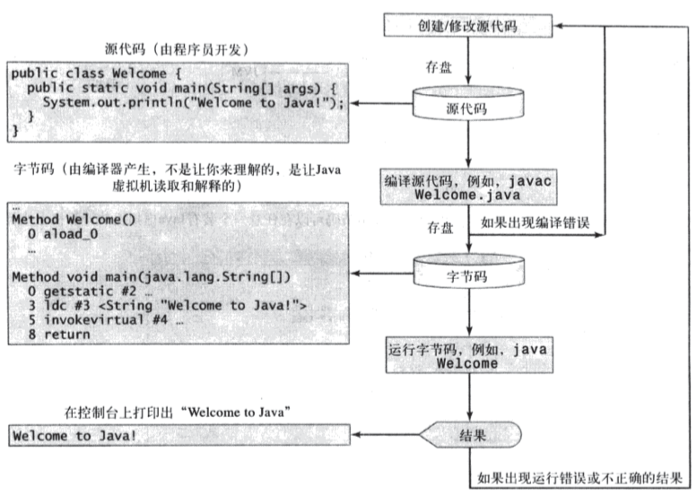
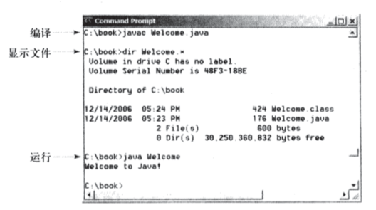

# 第一章 计算机、程序和Java概述
##基础知识
程序及其原理
操作系统做什么
Java历史，哪里诞生，最初用途，与互联网的关系，Java特点
API含义
Java版本及其适用领域
##Java程序
安装Java开发环境
一个完整的Java程序，理解每行代码的含义
Java程序的编译和运行过程
理解如下两张图示
图一

图二

从命令行编译及运行Java程序

浏览教材中提及的关键术语及小结部分

##课外练习
习题1.1 - 1.23

