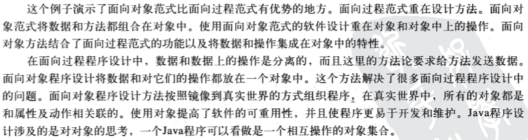

# 第10章 关于对象的思考

## 基础知识
* 不可变对象和类（immutable object/class），其实就是没有给使用者提供修改的机制
* 变量的作用域，只在当前变量声明的花括号对内是有效的
* this关键字
    * 是对当前所使用对象的引用，不能修改其值
    * 对当前成员变量的访问，其实都是通过this完成的
    * 使用this也可以在一个构造函数中，调用另外一个构造函数
* 抽象与封装
    * 类抽象（class abstraction），指分离类的实现和使用
    * 类合约（class contract），类的全部方法、数据域+相关描述，这个概念使用的不算很多
    * 类封装（class encapsulation），对用户隐藏实现细节，只提供必要的interface（Circle类文字说明+Load类的实现）
* 理解BMI示例的修改过程
    * 
* 对象的组合（composition），即一个对象中，包含另外一个对象，组合的对象表示两个对象具有一种has-a的关系，了解UML图中对此结构的表示方式
* 类的设计（Course/Stack/GuessDate），课下最好自己完成Stack类的实现及测试代码
* 类的设计原则，理解为主
    * 内聚性
    * 一致性
    * 封装性
    * 清晰性
    * 完整性
* 静态变量的原理及使用

##课外练习
习题 10.3 10.5 10.6 
编程练习题 10.1

