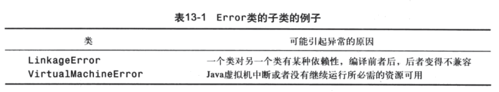
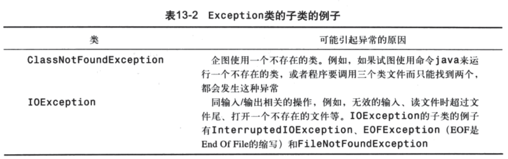
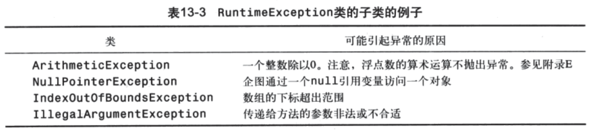

# 第13章 异常处理

## 基础知识
### 概述
* 异常处理是一种错误处理机制，跟传统的flag方式完全不同
* 异常处理机制做到了错误产生与错误处理的解耦处理
* 可能会产生异常的代码，放入try语句块
* 异常的捕获，使用catch语句块
* 异常的抛出，使用throws关键字
* 异常是有类型的，异常的抛出，实质是抛出了某种类型生成的一个对象，捕获到的则是该异常的拷贝
### 异常类型
* 异常类必须是Throwable的子类，实际实现时，一般会从Exception继承，标准库中的所有异常，都是Exception的子类，实际上，Exception也是Throwable的子类
* 异常分为三种主要类型：
    * 系统错误，用Error类表示，这种异常无需处理，也无法处理，称为免检异常(unchecked exception)
    * 普通异常，用Exception类表示，这些异常需要捕获和处理，称为必检异常(checked exception)
    * 运行时异常，用RuntimeException类表示，是Exception的子类，但是这种异常一般不需要捕获和处理 (unchecked exception)，产生时，表示代码出现了错误，需要修改代码
    * 图示如下
    
    
    
    
### 更多知识
* 声明异常 (declaring an exception)
``` 
public void myMethod() throws Exception1, Exception2  
```
* 抛出异常 (throwing an exception)
```
Exception1 e1 = new Exception1("e1");
throw e1;
```
* 捕获异常 (catching an exception) ，注意多个捕获器的排放顺序，应该从特殊到一般

```
try{
    statements;
}
catch(Exception1 e1) {
    handle it;
}
catch(Exception2 e2) {
    handle it;
}
catch(Exception3 e3) {
    handle it;
}
```

* 异常对象中，应该存储错误产生时的原因信息，应改写父类的`getMessage`函数予以实现
* finally语句块，Java独有（相比C++），正确的使用，可以节省大量资源处理代码
* 重新抛出异常，在catch语句块中使用throw抛出捕获的异常
* try/catch语句块可以嵌套使用

### 示例
* QuotientWithException.java 入门示例，这个例子中的异常其实是一个免检异常
* QuotientWithMethod.java 展示异常的创建方式，这个异常也是一个免检异常
* InputMismatchExceptionDemo.java 常规使用
* TestException.java 查看异常对象中封装的信息
* CircleWithException.java 一个完整示例
* InvalidRadiusException.java及其测试类，自定义异常的实现

##课外练习
课后全部复习题
编程练习题 13.1 13.2 13.3 13.6


