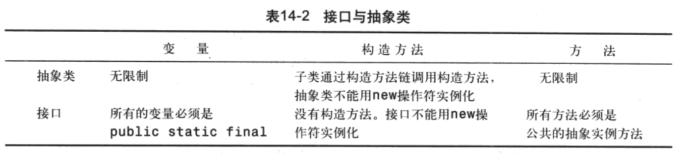

# 第14章 抽象类和接口

## 基础知识
### 抽象类
* 表征某个概念或者某类事物的共同特征，没有必要也没有理由生成对象，可定义为抽象类，abstract class，可参看GeometricObject类实现
* 抽象方法只有定义而没有实现，由子类实现，包含抽象方法的类即为抽象类
* 抽象类不能使用new创建对象，一般作为概念存在，位于类层级结构的顶层，标准库中的Calendar类，是一个抽象类设计的示例

### 接口
* interface，是一种与类类似的结构，只能包含常量（这是早期Java程序员常用的全局常量解决方案）和方法（这些方法都是抽象的）
* interface本质上也就是类，可以理解其为抽象的无法再抽象的类，以至于干脆改了个名称，implements interface和extends class，其实质是一样的
* Java语言中要求，实现某个接口，必须要实现其中定义的所有方法
* 一个接口也可以使用extends关键字继承其他的接口，这是常用的接口继承扩展方式，可参阅Java标准库中集合类的List等接口实现代码
* 标准库中很常见的接口有Comparable/Serializable/Cloneable等
    * Comparable接口是完成对象比较时常见的接口，Java集合的实现，也会检查欲比较的对象是否实现了此接口
    * Serializable接口是标记对象是否可以被序列化的marker interface
    * Cloneable接口是生成对象克隆体时，可能需要实现的一个接口，要理解浅复制和深复制的概念
    
### 接口与抽象类的比较

* Java只允许单根继承，但允许同时继承多个接口，如

```java
public class extends A implements B, C, D{
}
```
* 一般描述父子关系的`强是`(strong is-a relationship)关系时，用类继承，而接口一般表示`弱是`(weak is-a relationship)关系，也即隶属关系，表明对象拥有某种属性。

### Wrapper class
* 前面已经提及过，其目的是为了将基本类型封装为对象，以便处理
* JDK1.5之后，增加了自动装箱(auto boxing)和自动拆箱(auto un-boxing)机制，方便程序员，但转换工作一点没少
* 了解BigInteger和BigDecimal及其用法

### 接口的应用示例
* 入门示例 TestEdible.java
* 很多教材中的通用示例 Animal.java
* Comparable的使用
    * ComparableRectangle.java
    * GenericSort.java
    * Java包中所有基本类型中数值型的Wrapper Class，包括BigDecimal和BigInteger，建议详读源代码
* 课本提供的Rational类，一定要掌握其具体实现

##课外练习
复习题和综合题
编程练习题 14.1


