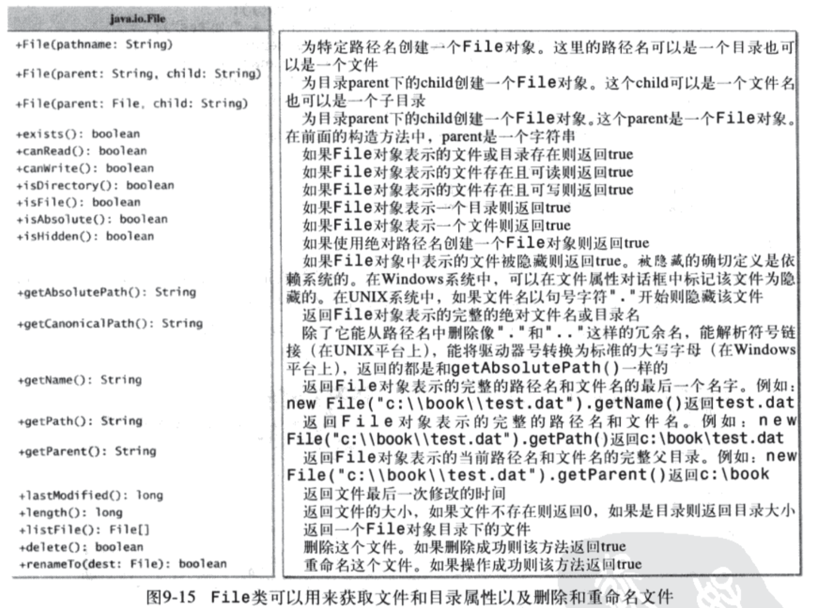
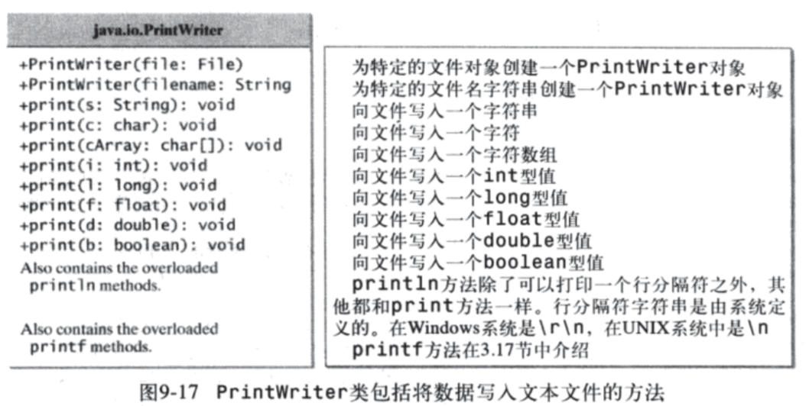
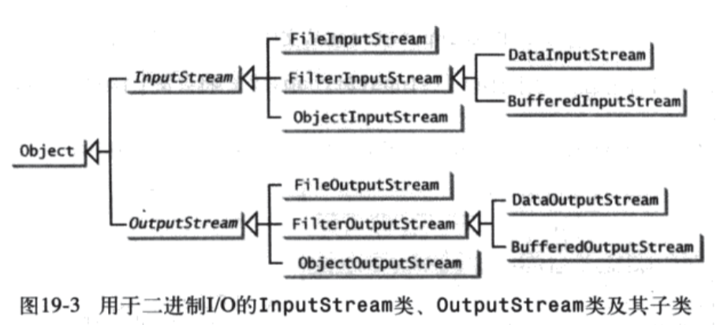

# 输入输出 I/O
## 基础知识
### File类（第9章）
* 对文件提供了一种不依赖机器的抽象
* 包含许多获取文件属性的方法以及重命名和删除文件的方法
* 但是，`不包括`读写文件内容的方法
* 
* 示例 TestFileClass.java

### 文本I/O（第9章）
* PrintWriter类(Java.io包)
    * 可用于创建文件，并向文本文件写入数据
    * 一般利用File对象创建PrintWriter对象
    * 示例 WriteData.java
    * 
    * 注意要关闭文件及捕获及处理相关异常
* Scanner类(Java.util包)
    * 
    * 示例 ReadData.java/ReplaceText.java
    * ```useDelimiter(String regex)```方法可设置读取分隔方式
    * 注意要捕获和处理必要的异常

### 二进制I/O
* 所有文件，本质上都是以二进制方式存储的
* 二进制方式处理文件，效率较文本I/O更高，而且可移植
* 二进制I/O处理类，类名中均以`Stream`为后缀，对应的，文本I/O处理的类，是以`Reader`或`Writer`为后缀的
* I/O相关的类层次结构设计，是为了编程者更方便地进行功能组合，灵活地完成相关工作，设计中参考了设计模式中的`Decoration`模式
* 
* 这种设计中（文本I/O也类似），类被分为两种，一种为低级类（Low Level Class），负责真正的读写数据，如，`FileInputStream`或`FileOutputStream`，但功能及其有限，只能完成基本的字节读写，另一种为高级类（High Level Class），需要基于低级类的数据读写，额外赋予使用者新的功能，如，`DataInputStream`和`ObjectOutputStream`，可以使得使用者完成基本数据类型如整数、字符串甚至对象的读写功能
* 常见使用方式：

  ```java
  File file = new File("mydata");
  FileInputStream fis = new FileInputStream(file);
  // fis只提供字节读取功能，具体可查阅相应API
  DataInputStream dis = new DataInputStream(fis);
  // dis时，可提供基本数据类型的读取
  ObjectInputStream ois = new ObjectInputStream(dis);
  // ois时，可进行对象的读取功能
  ```
* 以上这种使用方式，是通过`decoration`设计模式达成
* 示例
    * TestFileStream.java
    * TestDataStream.java
    * DetectEndOfFile.java
    * Copy.java
    
### 对象的输入和输出
* 也称对象的序列化，相关规范 (https://docs.oracle.com/javase/8/docs/platform/serialization/spec/serialTOC.html)
* 基本思路是，如果希望一个对象能够被写入磁盘（也即序列化），那么此对象的类证明时，必须实现`Serializable`接口
* Serializable接口是一个标记接口，内部不包含任何方法，仅仅是做一个marker，Serializable接口的在线文档 (https://docs.oracle.com/javase/8/docs/api/java/io/Serializable.html)
* 序列化也是Java实现远程方法调用（RMI）的基础
* 示例
    * TestObjectOutputStream.java
    * TestObjectInputStream.java
    * TestObjectStreamForArray.java
* RandomAccessFile类，历史遗留类，是当初设计不周的产物，一般不用

## 课外练习
* 思考复习题（全部）
* 编程练习题（19.1和19.2，并比对生成文件）

