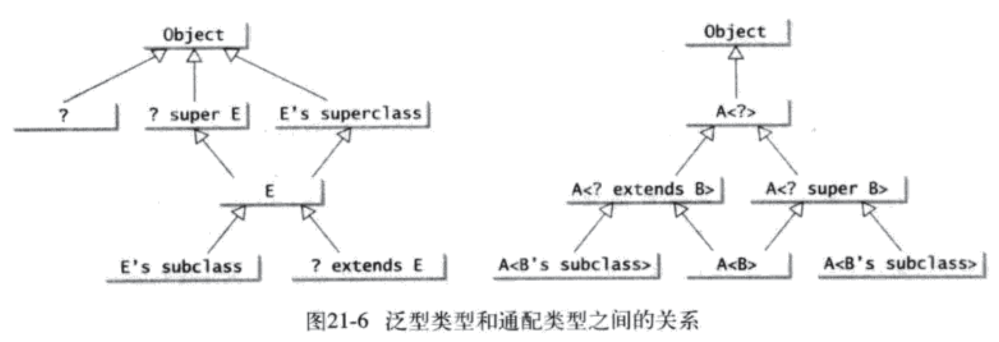
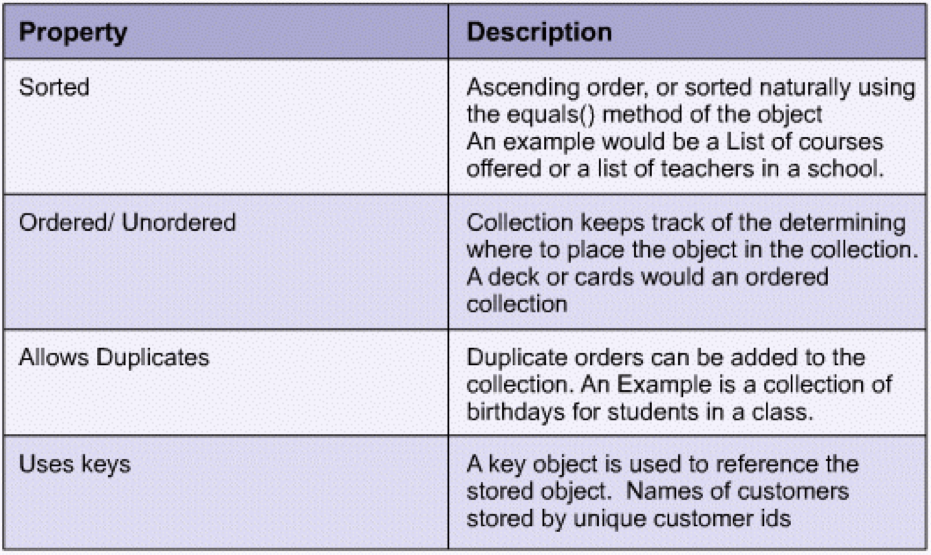
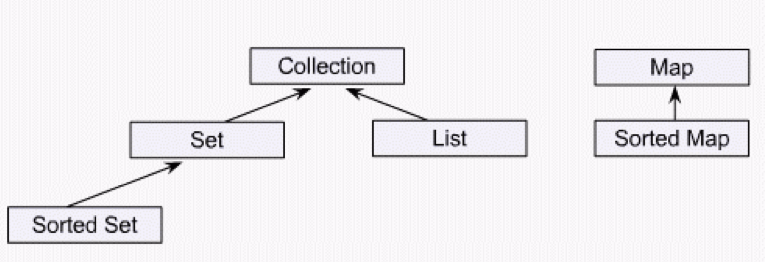
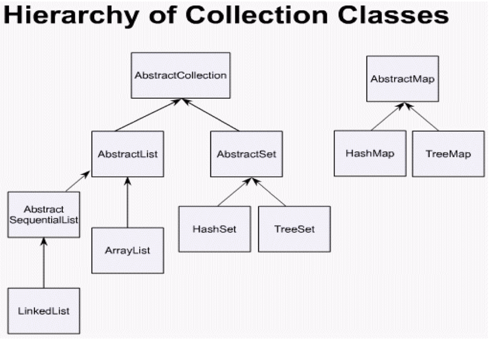

# 第21-22章 泛型及集合框架

## 基础知识
### 泛型
* 泛型(generic)是指参数化类型的能力，可以与C++里的模板类相类比，JDK5.0时引入Java语言
* 使用时，可定义带泛型类型的类或方法，编译器会用具体的类型来替代它
* 其主要优点一是泛化某个概念，二是在编译阶段即可发现错误，便于调试
* 掌握泛型类的定义与使用
* 掌握泛型函数的定义与调用
* 通配泛型
    * `?` 非受限通配(unbounded wilecard) 相当于`? extends Object`
    * `? extends T` 受限通配(bounded wildcard)，表示T或T的一个未知子类型
    * `? super T` 下限通配(lower-bound wildcard)，表示T或者T的一个未知父类型
    * 
* 示例
    * GenericStack.java 一个通用Stack类
    * GenericMethodDemo.java 泛型函数的定义与使用示例
    * BoundedTypeDemo.java 受限泛型示例
    * Max1.java 利用受限通配技术，编写泛型方法
    * WildCardDemo1.java 了解为何有编译错误
    * WildCardDemo2.java/WildCardDemo3.java 利用受限通配技术，解决前述代码中的问题
    * GenericMatrix.java 泛型矩阵类，编写通用解决方法的方式
    
### 集合框架
####概述
* 一种数据结构，在面向对象思想中，也被认为是一个容器(container)，具体实现为`能够存储其他对象的对象`，一般要求提供对其内部存储对象的`增删改查`功能
* 每一个某类数据结构的实现，就是一种集合，比如基于数组实现的ArrayList，基于链表实现的LinkedList，基于哈希表实现的HashSet等
* 这些集合分为两大类，一种是存储一个元素，简称为集合，一种是为了存储键/值对，称为Map，上面所提及的元素和键值对，必须都是对象，基本数据类型(如int, double等)无法直接存储入集合，这也是Wrapper Class存在的原因
* Java标准库中，有一套Java集合框架(Java Collections Framework)，是通过编写大量类和接口完成的
* Java标准库中集合类，绝大多数都是基于泛型编程实现的

#### 掌握集合类
* 要用好集合类，对每个类要了解三方面内容
    * 存储技术 - Storage Technologies
    * 属性 - Properties
    * 类型 - types

    1. 存储技术：包括数组Array，链表Linked-list，树Tree，哈希表HashTable，能从具体类名称中的第一个单词看出来，如LinkedList, ArrayList, TreeSet等
    2. 属性：
        * Sorted - 是否排序
        * Ordered/Unordered - 是否可以通过下标访问集合中的元素
        * Allows Duplicates - 允许重复
        * Uses Keys - 是否可以使用key来访问value
    
    3. 类型：包括Collection, Lists, Sets, Maps
        * Collection - Unordered， 允许重复
        * Lists - Ordered， 允许重复， 如Array, Vector, LinkedList, Stack, Queue等类
        * Sets - Unordered，不允许重复，如各种类名称中第二个单词为Set的类
        * Maps - 存储的是k/v对，也叫做字典类型

* Java集合框架实现技术
    * Framework - a set of rules or guildlines
    * 集合共性的提取与设计，体现在Java集合框架中的6个`Interface` 中
        * 接口继承图如下所示 
            1. Collection接口 - `unordered/允许重复`的集合使用，内部包括各种集合的通用方法
            2. List接口 - `ordered/允许重复`的集合使用，增加了通过下标访问元素的方法
            3. Set接口 - `不允许重复`的集合使用
            4. SortedSet接口 - `不允许重复/排序`的集合使用
            5. Map接口 - `Use keys`的集合使用，其内部还包括Map.Entry接口
            6. SortedMap接口 - `Use keys/排序`的集合使用
        * 建议大家查看这些接口的源代码

    * 集合类层次结构
        * 
        * 图中的抽象类是实现了相应接口的、表征概念的类，子类则为我们编程中实际使用的类
        * 由于历史原因，Java中的一些常用集合类，如Vector/Stack/Dictionary/HashTable/Properties等，不在这个类层次结构中
    * 集合类的选择
        * 综上，对于集合中的每个类，使用前要了解其适用范围
        * 范例如图 
    * 集合通用的遍历方式，体现在`Iterator`和`ListIterator`两个接口中
    * Collections类中，提供了很多集合通用方法，如sort(), reverse(), shuffle()
    * 对于能够排序的集合的具体实现，可查阅Comparable和Comparator接口代码以及相关类的具体实现
* 阅读课本中的示例代码

##课外练习
* 学习GenericMatrix.java，建议自己完整输入全部代码，并用`各种类型（如double、rational、BigDecimal等）`的数值矩阵进行运算，理解其通用性如何达成及有哪些限制
* 做21、22章的课后复习题
* 编程练习题
    * 22.1
    * 22.2

